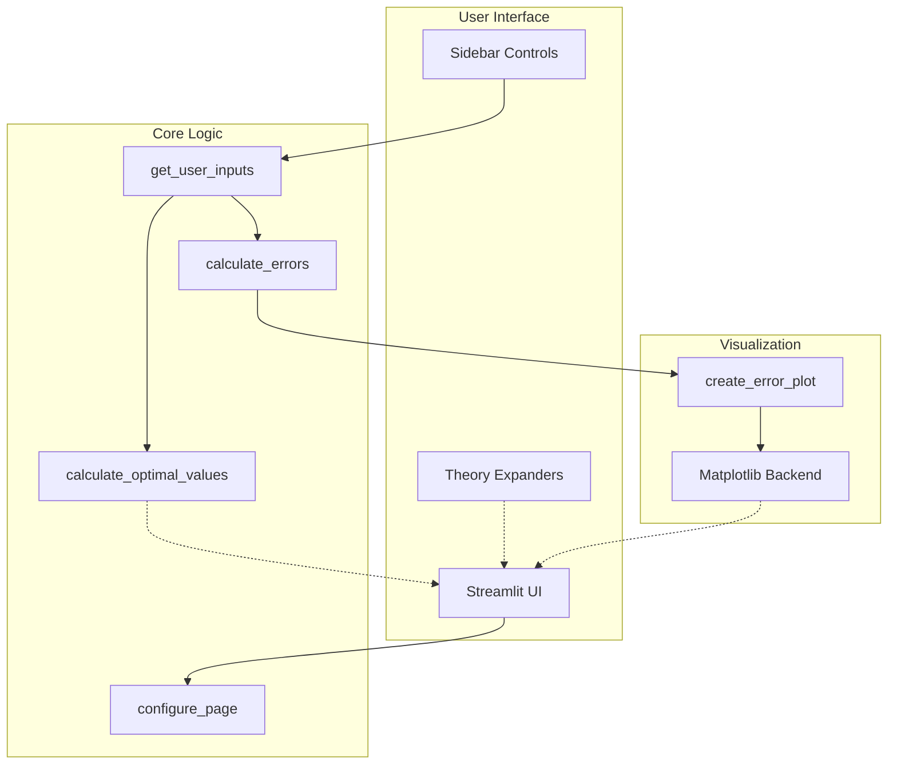

# Numerical Differentiation Error Analysis

A scientific computing web application that analyzes and visualizes errors in numerical differentiation methods.

[](https://math374p1.streamlit.app/)
[](LICENSE.md)
[](https://www.python.org/downloads/)
[](https://streamlit.io)

**🔗 Live Demo:** [https://math374p1.streamlit.app/](https://math374p1.streamlit.app/)

## Overview

This interactive Streamlit application compares forward difference and central difference numerical differentiation methods for f(x) = sin(x) at x = 1. It visualizes how truncation and rounding errors behave as step size (h) varies, helping users understand the trade-offs in numerical methods.

Built for Math 374 - Scientific Computing (Spring 2024) by John Akujobi.

## Screenshots

<details>
<summary>View Application Screenshots</summary>


</details>

## Key Features

All features listed below are implemented and verified in [`streamlit_app.py`](streamlit_app.py):

- **Interactive Error Analysis** - Adjust step size range (10^-k), number of points, and machine epsilon (ε) via sidebar controls ([code](streamlit_app.py#L46-L56))
- **Dual Method Comparison** - Side-by-side visualization of forward and central difference methods ([code](streamlit_app.py#L490-L494))
- **Log-Log Error Plots** - Display actual error, truncation error bounds, and rounding error bounds ([code](streamlit_app.py#L111-L139))
- **Optimal Step Size Calculation** - Computes h_opt that minimizes total error for both methods ([code](streamlit_app.py#L144-L163))
- **Theoretical Background** - Expandable sections explaining mathematical derivations ([code](streamlit_app.py#L165-L465))
- **Comparison Table** - Summary of truncation order, rounding order, and stability ([code](streamlit_app.py#L522-L537))
- **MathJax Support** - Proper LaTeX equation rendering ([code](streamlit_app.py#L25-L26))

## Architecture



**Component Responsibilities:**

- **`configure_page()`** - Page setup, CSS styling, MathJax loading
- **`get_user_inputs()`** - Sidebar controls for h range, points, epsilon
- **`calculate_errors()`** - Computes actual errors and theoretical bounds (cached with `@st.cache_data`)
- **`create_error_plot()`** - Generates matplotlib log-log plots
- **`calculate_optimal_values()`** - Determines optimal h for minimum error
- **`Report()`** - Renders expandable project documentation sections
- **`main()`** - Application orchestration and flow control

See [docs/DEVELOPMENT.md](docs/DEVELOPMENT.md) for detailed architecture and development guide.

## Quick Start

### Prerequisites

- Python 3.12 or higher ([verified in environment](https://www.python.org/downloads/))
- pip (Python package installer)

### Installation

```bash
# Clone the repository
git clone https://github.com/jakujobi/Math374Project1.git
cd Math374Project1

# Install dependencies
pip install -r requirements.txt
```

### Run Locally

```bash
streamlit run streamlit_app.py
```

The app will open in your default browser at `http://localhost:8501`.

### Using GitHub Codespaces

This project is configured for GitHub Codespaces with automatic setup:

1. Open in Codespaces from the repository page
2. Wait for dependencies to install (automated via [`.devcontainer/devcontainer.json`](.devcontainer/devcontainer.json))
3. App auto-starts on port 8501

## Usage

### Interactive Controls

Use the sidebar to configure parameters:

| Control              | Range          | Default  | Purpose                             |
| -------------------- | -------------- | -------- | ----------------------------------- |
| Minimum h (10^-k)    | 1-16           | 1        | Sets h_min = 10^-1                  |
| Maximum h (10^-k)    | 1-16           | 16       | Sets h_max = 10^-16                 |
| Number of points     | 10-100         | 50       | Data points between h_min and h_max |
| Machine epsilon (ε) | 1e-16 to 1e-10 | 2.22e-16 | Rounding error parameter            |

### Understanding the Output

**Error Plots:**

- **Blue line** - Actual error measured from numerical computation
- **Red dashed** - Truncation error bound (O(h) forward, O(h²) central)
- **Green dashed** - Rounding error bound (O(ε/h))

**Optimal Values:**

- **Forward difference:** h_opt ≈ √(2ε) ≈ 2.11e-08
- **Central difference:** h_opt ≈ ∛(3ε) ≈ 8.73e-06

### Example Workflow

1. **Default View** - Launch app to see preset parameters
2. **Adjust h Range** - Set min=1, max=16 to scan 10^-1 to 10^-16
3. **Compare Methods** - Observe central difference achieves better accuracy
4. **Find Sweet Spot** - Note where actual error curves reach minimum
5. **Verify Theory** - Check optimal h values match theoretical predictions

## Configuration

No environment variables or configuration files required. All settings are adjustable via the Streamlit UI.

## Testing

Manual verification (no automated tests):

```bash
# Test imports and basic functionality
python3 -c "import streamlit_app; print('✓ Imports successful')"

# Verify error calculations
python3 -c "
import numpy as np
from streamlit_app import calculate_errors, calculate_optimal_values

h_values = np.logspace(-16, -1, 50)
results = calculate_errors(h_values, 2.22e-16)
print(f'✓ Calculated {len(results[\"h\"])} data points')

optimal = calculate_optimal_values(2.22e-16)
print(f'✓ Forward h_opt: {optimal[\"forward\"][\"h_opt\"]:.2e}')
print(f'✓ Central h_opt: {optimal[\"central\"][\"h_opt\"]:.2e}')
"
```

Expected output:

```
✓ Imports successful
✓ Calculated 50 data points
✓ Forward h_opt: 2.11e-08
✓ Central h_opt: 8.73e-06
```

## Project Status

**Current Version:** 1.0 (Spring 2024)
**Status:** Complete - Academic project submission

This was developed as a course project and is not actively maintained for new features. Pull requests for bug fixes are welcome.

## What This Project Demonstrates

This project showcases technical skills relevant to scientific computing and software engineering:

| Skill Area                         | Implementation                                                       | Code Reference                                     |
| ---------------------------------- | -------------------------------------------------------------------- | -------------------------------------------------- |
| **Numerical Methods**        | Taylor series error analysis, finite difference methods              | [`calculate_errors()`](streamlit_app.py#L62-L106)   |
| **Scientific Computing**     | NumPy array operations, error propagation, floating-point arithmetic | [`streamlit_app.py`](streamlit_app.py#L13-L15)      |
| **Data Visualization**       | Log-log plots, matplotlib customization, comparative analysis        | [`create_error_plot()`](streamlit_app.py#L111-L139) |
| **Web Development**          | Streamlit app architecture, responsive UI, LaTeX rendering           | [`configure_page()`](streamlit_app.py#L20-L33)      |
| **Performance Optimization** | Caching expensive computations with `@st.cache_data`               | [`calculate_errors()`](streamlit_app.py#L61)        |
| **Documentation**            | Mathematical exposition, interactive documentation                   | [`Report()`](streamlit_app.py#L165-L465)            |
| **DevOps**                   | Streamlit Cloud deployment, GitHub Codespaces config                 | [`.devcontainer/`](.devcontainer/devcontainer.json) |

## Contributing

See [CONTRIBUTING.md](CONTRIBUTING.md) for contribution guidelines.

## License

This project is licensed under the [Hippocratic License 3.0](LICENSE.md) (HL3-BOD-CL-ECO-LAW-MEDIA-MIL-SV).

The Hippocratic License is an ethical source license that specifically prohibits use of the software for activities that violate human rights or cause harm. See the [First Do No Harm](https://firstdonoharm.dev/) initiative for details.

## Author

**John Akujobi**
Math 374 - Scientific Computing
Spring 2024

## Acknowledgments

- Course: Math 374 - Scientific Computing
- Platform: [Streamlit](https://streamlit.io/) for rapid web app development
- Hosting: [Streamlit Community Cloud](https://streamlit.io/cloud)
