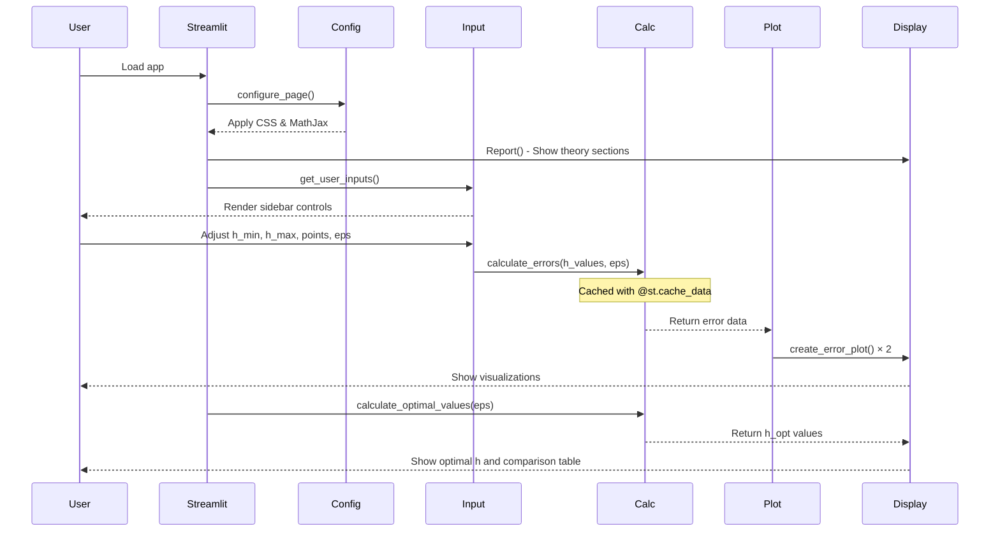

# Development Guide

This document provides technical details for developers working on or extending the Numerical Differentiation Error Analysis project.

## Table of Contents

- [Project Structure](#project-structure)
- [Development Setup](#development-setup)
- [Architecture](#architecture)
- [Code Organization](#code-organization)
- [Key Algorithms](#key-algorithms)
- [Adding Features](#adding-features)
- [Deployment](#deployment)

## Project Structure

```
Math374Project1/
├── streamlit_app.py          # Main application file (541 lines)
├── requirements.txt          # Python dependencies
├── LICENSE.md                # Hippocratic License 3.0
├── README.md                 # User-facing documentation
├── Project 1 Report - John Akujobi.md  # Academic report
├── Project 1 Report - John Akujobi.pdf # Academic report PDF
├── Screenshot 2025-02-14 012749.png    # App screenshot 1
├── Screenshot 2025-02-14 013149.png    # App screenshot 2
├── docs/
│   ├── DEVELOPMENT.md        # This file
│   └── ARCHITECTURE.md       # System architecture (TODO)
├── .devcontainer/
│   └── devcontainer.json     # GitHub Codespaces config
├── .github/
│   └── CODEOWNERS            # Repository ownership
└── .gitignore                # Git ignore patterns
```

## Development Setup

### Local Development

**Prerequisites:**
- Python 3.12+ (verified: 3.12.3)
- pip 20.0+

**Setup Steps:**

```bash
# Clone repository
git clone https://github.com/jakujobi/Math374Project1.git
cd Math374Project1

# Create virtual environment (recommended)
python3 -m venv venv
source venv/bin/activate  # On Windows: venv\Scripts\activate

# Install dependencies
pip install -r requirements.txt

# Run application
streamlit run streamlit_app.py
```

**Access:** Application starts at `http://localhost:8501`

### GitHub Codespaces

The project includes a pre-configured devcontainer:

**Automatic Setup:**
1. Click "Code" → "Create codespace on main"
2. Codespace auto-installs dependencies via `.devcontainer/devcontainer.json`
3. Streamlit auto-starts on port 8501
4. Click "Open in Browser" when prompted

**Manual Start (if needed):**
```bash
streamlit run streamlit_app.py --server.enableCORS false --server.enableXsrfProtection false
```

## Architecture

### Application Flow



### Module Responsibilities

| Module | Lines | Purpose | Key Functions |
|--------|-------|---------|---------------|
| Configuration | 20-33 | Page setup, styling | `configure_page()` |
| Theory Display | 165-465 | Documentation sections | `Report()` |
| User Input | 46-56 | Sidebar controls | `get_user_inputs()` |
| Computation | 62-106 | Error calculations | `calculate_errors()` |
| Visualization | 111-139 | Plot generation | `create_error_plot()` |
| Optimization | 144-163 | Optimal h values | `calculate_optimal_values()` |
| Main Flow | 470-541 | Orchestration | `main()` |

## Code Organization

### Function Reference

#### `configure_page()`
**Location:** Lines 20-33  
**Purpose:** Initialize Streamlit page configuration
```python
def configure_page():
    st.set_page_config(page_title="Numerical Differentiation Analysis", layout="wide")
    # Custom CSS and MathJax injection
```

**What it does:**
- Sets page title and wide layout
- Injects custom CSS for styling
- Loads MathJax CDN for LaTeX rendering

#### `get_user_inputs()`
**Location:** Lines 46-56  
**Return:** Dictionary with keys: `h_min`, `h_max`, `num_points`, `eps`

**Controls:**
- `h_min`: Slider 1-16 (default: 1) → 10^-k lower bound
- `h_max`: Slider 1-16 (default: 16) → 10^-k upper bound
- `num_points`: Slider 10-100 (default: 50)
- `eps`: Number input 1e-16 to 1e-10 (default: 2.22e-16)

#### `calculate_errors(h_values, eps)`
**Location:** Lines 62-106  
**Caching:** `@st.cache_data` - Results cached by input parameters  
**Return:** Dictionary with keys: `h`, `err1`, `err2`, `trunc1`, `trunc2`, `round1`, `round2`

**Algorithm:**
```python
for each h in h_values:
    # Forward difference
    approx1 = (sin(1+h) - sin(1)) / h
    err1 = |approx1 - cos(1)|
    trunc1 = h/2                    # O(h) truncation
    round1 = 2*eps/h                # O(eps/h) rounding
    
    # Central difference
    approx2 = (sin(1+h) - sin(1-h)) / (2*h)
    err2 = |approx2 - cos(1)|
    trunc2 = h²/6                   # O(h²) truncation
    round2 = eps/h                  # O(eps/h) rounding
```

**Error Handling:** Returns `None` on exception with `st.error()` message

#### `create_error_plot(data, method)`
**Location:** Lines 111-139  
**Parameters:**
- `data`: Results from `calculate_errors()`
- `method`: `'forward'` or `'central'`

**Return:** `matplotlib.figure.Figure` object

**Plot Elements:**
- Blue solid line: Actual error
- Red dashed line: Truncation error bound
- Green dashed line: Rounding error bound
- Log-log scale for both axes
- Grid for readability

#### `calculate_optimal_values(eps)`
**Location:** Lines 144-163  
**Return:** Dictionary with `'forward'` and `'central'` keys

**Formulas:**
```python
# Forward difference
h_opt = √(2ε)
min_error = √(2ε) / 2

# Central difference
h_opt = ∛(3ε)
min_error = (3ε)^(2/3) / 6
```

**Derivation:** Based on balancing truncation and rounding error bounds

#### `Report()`
**Location:** Lines 165-465  
**Purpose:** Render expandable documentation sections

**Sections:**
1. Project Question & Tasks
2. Introduction
3. Background and Theory
4. Project Objectives
5. Implementation Details
6. Running the App
7. Results & Discussion
8. Conclusion

#### `main()`
**Location:** Lines 470-541  
**Purpose:** Application entry point

**Execution Flow:**
1. Configure page
2. Display title
3. Show Report() sections
4. Get user inputs
5. Generate h_values array
6. Calculate errors (cached)
7. Display side-by-side plots
8. Show optimal values
9. Display comparison table

## Key Algorithms

### Taylor Series Error Analysis

**Forward Difference:**
```
f'(x) ≈ [f(x+h) - f(x)] / h

Taylor expansion:
f(x+h) = f(x) + h·f'(x) + (h²/2)·f''(x) + O(h³)

Therefore:
[f(x+h) - f(x)] / h = f'(x) + (h/2)·f''(x) + O(h²)

Truncation error: (h/2)·|f''(x)| = O(h)
```

**Central Difference:**
```
f'(x) ≈ [f(x+h) - f(x-h)] / (2h)

Taylor expansions:
f(x+h) = f(x) + h·f'(x) + (h²/2)·f''(x) + (h³/6)·f'''(x) + O(h⁴)
f(x-h) = f(x) - h·f'(x) + (h²/2)·f''(x) - (h³/6)·f'''(x) + O(h⁴)

Subtracting:
f(x+h) - f(x-h) = 2h·f'(x) + (2h³/6)·f'''(x) + O(h⁵)

Therefore:
[f(x+h) - f(x-h)] / (2h) = f'(x) + (h²/6)·f'''(x) + O(h⁴)

Truncation error: (h²/6)·|f'''(x)| = O(h²)
```

### Rounding Error Estimation

For f(x) = sin(x) with values ~ O(1):

**Forward Difference:**
- Computes: [f(x+h) - f(x)] / h
- Relative error in subtraction: ε
- After division by h: 2ε/h

**Central Difference:**
- Computes: [f(x+h) - f(x-h)] / (2h)
- Relative error in subtraction: ε
- After division by 2h: ε/h

### Optimal h Calculation

Minimize total error = truncation + rounding:

**Forward:** E(h) = Ch + Dε/h
- Derivative: E'(h) = C - Dε/h²
- Set E'(h) = 0: h² = Dε/C
- With C=1/2, D=2: h_opt = √(2ε)

**Central:** E(h) = Ch² + Dε/h
- Derivative: E'(h) = 2Ch - Dε/h²
- Set E'(h) = 0: 2Ch³ = Dε
- With C=1/6, D=1: h_opt = ∛(3ε)

## Adding Features

### Adding a New Differentiation Method

1. **Implement calculation in `calculate_errors()`:**
```python
# Third-order forward difference example
approx3 = (-f(x+2h) + 8*f(x+h) - 8*f(x-h) + f(x-2h)) / (12*h)
results['err3'].append(abs(approx3 - exact))
results['trunc3'].append(h**4 / 30)  # O(h⁴)
results['round3'].append(4*eps/h)    # 4 function evaluations
```

2. **Add plot generation:**
```python
# In main()
with col3:
    st.pyplot(create_error_plot(results, 'third_order'))
```

3. **Update optimal value calculation:**
```python
# In calculate_optimal_values()
'third_order': {
    'h_opt': (30 * eps) ** (1/5),  # Balance O(h⁴) and O(ε/h)
    'min_error': ...
}
```

### Adding New Visualizations

Example: Add error ratio plot
```python
def create_ratio_plot(data):
    """Plot central/forward error ratio"""
    fig, ax = plt.subplots(figsize=(8, 6))
    ratio = np.array(data['err2']) / np.array(data['err1'])
    ax.semilogx(data['h'], ratio)
    ax.set_xlabel("h (log scale)")
    ax.set_ylabel("Central Error / Forward Error")
    ax.grid(True)
    return fig

# In main()
st.header("Error Ratio Analysis")
st.pyplot(create_ratio_plot(results))
```

### Performance Optimization Tips

1. **Use caching aggressively:**
```python
@st.cache_data
def expensive_computation(...):
    # Cached based on input parameters
```

2. **Reduce plot redraws:**
```python
# Cache figure creation
@st.cache_resource
def create_static_plot(...):
    # Only recreates when inputs change
```

3. **Lazy load theory sections:**
```python
# Already implemented with st.expander()
with st.expander("Theory", expanded=False):
    # Content only renders when expanded
```

## Deployment

### Streamlit Community Cloud

**Current Deployment:** https://math374p1.streamlit.app/

**Deployment Process:**
1. Push changes to GitHub main branch
2. Streamlit Cloud auto-detects changes
3. Automatic rebuild and redeploy
4. No manual steps required

**Configuration:**
- Managed via `.devcontainer/devcontainer.json`
- CODEOWNERS: `@streamlit/community-cloud`

### Alternative: Self-Hosted

```bash
# Production server with gunicorn (not applicable for Streamlit)
# Streamlit uses its own server

# Run on custom port
streamlit run streamlit_app.py --server.port 8080

# Run on all interfaces
streamlit run streamlit_app.py --server.address 0.0.0.0

# Production settings
streamlit run streamlit_app.py \
  --server.port 8501 \
  --server.enableCORS false \
  --server.enableXsrfProtection true
```

### Docker Deployment

Create `Dockerfile`:
```dockerfile
FROM python:3.12-slim

WORKDIR /app

COPY requirements.txt .
RUN pip install --no-cache-dir -r requirements.txt

COPY streamlit_app.py .
COPY Screenshot*.png .

EXPOSE 8501

CMD ["streamlit", "run", "streamlit_app.py", "--server.address", "0.0.0.0"]
```

Build and run:
```bash
docker build -t math374-app .
docker run -p 8501:8501 math374-app
```

## Testing Strategy

**Current Status:** No automated tests

**Manual Testing Checklist:**
- [ ] App loads without errors
- [ ] All sidebar controls respond correctly
- [ ] Error calculations produce valid results
- [ ] Plots render correctly
- [ ] Optimal values display expected ranges
- [ ] Expandable sections open/close
- [ ] LaTeX equations render properly
- [ ] Comparison table displays correctly

**Future Testing Recommendations:**

1. **Unit Tests:**
```python
# tests/test_calculations.py
import pytest
import numpy as np
from streamlit_app import calculate_errors, calculate_optimal_values

def test_calculate_errors():
    h_values = np.array([1e-8])
    eps = 2.22e-16
    results = calculate_errors(h_values, eps)
    
    assert len(results['h']) == 1
    assert results['err1'][0] > 0
    assert results['err2'][0] > 0
    assert results['trunc1'][0] == h_values[0] / 2
    assert results['trunc2'][0] == h_values[0]**2 / 6

def test_optimal_values():
    eps = 2.22e-16
    optimal = calculate_optimal_values(eps)
    
    assert 'forward' in optimal
    assert 'central' in optimal
    assert optimal['forward']['h_opt'] > optimal['central']['h_opt']
```

2. **Integration Tests:**
```python
# tests/test_integration.py
from streamlit.testing.v1 import AppTest

def test_app_startup():
    at = AppTest.from_file("streamlit_app.py")
    at.run()
    assert not at.exception
```

## Troubleshooting

### Common Issues

**Issue:** Plots not displaying
```python
# Solution: Ensure matplotlib backend is set
import matplotlib
matplotlib.use('Agg')
import matplotlib.pyplot as plt
```

**Issue:** Caching not working
```python
# Solution: Clear cache
st.cache_data.clear()
```

**Issue:** LaTeX not rendering
```python
# Solution: Verify MathJax CDN is accessible
# Check browser console for 404 errors
# Ensure unsafe_allow_html=True in st.markdown()
```

## Code Style

**Current Style:** Informal, academic project style

**Recommended Improvements:**
- Add type hints: `def calculate_errors(h_values: np.ndarray, eps: float) -> dict:`
- Add docstrings in Google style
- Use Black formatter: `black streamlit_app.py`
- Add pylint checks: `pylint streamlit_app.py`

## Further Reading

- [Streamlit Documentation](https://docs.streamlit.io/)
- [NumPy Documentation](https://numpy.org/doc/)
- [Matplotlib Documentation](https://matplotlib.org/stable/contents.html)
- [Numerical Differentiation (Wikipedia)](https://en.wikipedia.org/wiki/Numerical_differentiation)
- [Floating-Point Arithmetic (Goldberg)](https://docs.oracle.com/cd/E19957-01/806-3568/ncg_goldberg.html)
